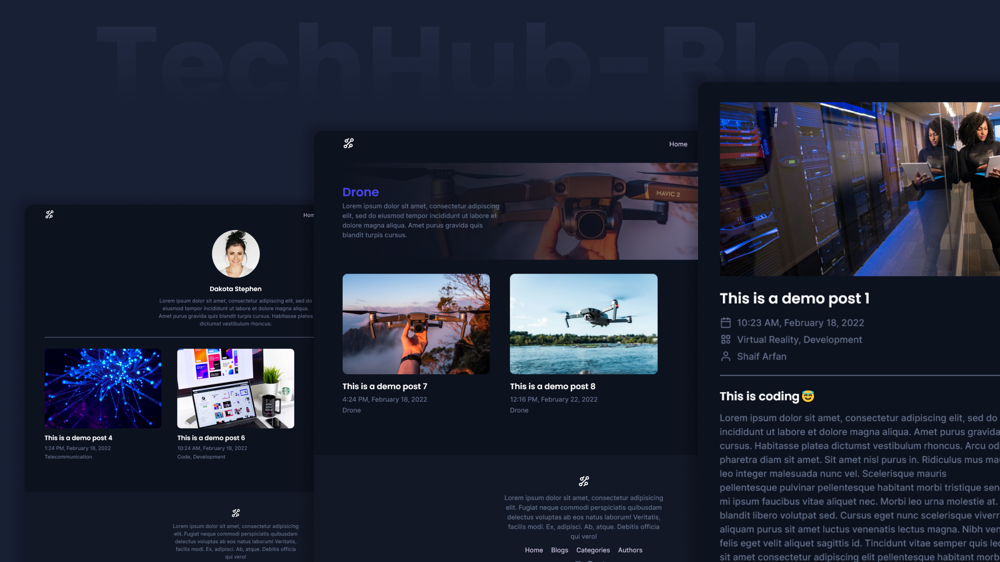

# TechHub-Blog

A complete blog website created with `JAMstack`. ([Gatsby.js](https://www.gatsbyjs.org/) & [Sanity.io](https://sanity.io)).

**Live Preview: [http://techhub-blog.vercel.app/][preview]**

## Project Details

TechHub-blog is a complete tech blog website. Here we will see three post types: `blogs`, `categories`, and `authors`. We will create relations between these three post types. So that we can create a blog post with a category and an author. Also we will make a `search feature` where we can search against all these three post types.

To create this website we will use `JAMstack`. We will use `Gatsby.js` for the frontend and `Sanity.io` for the headless CMS. And to source our content we will use `graphql`.

## Tools Used

- Images: Unsplash
- UI Design: Figma
- Code Editor: VS Code
